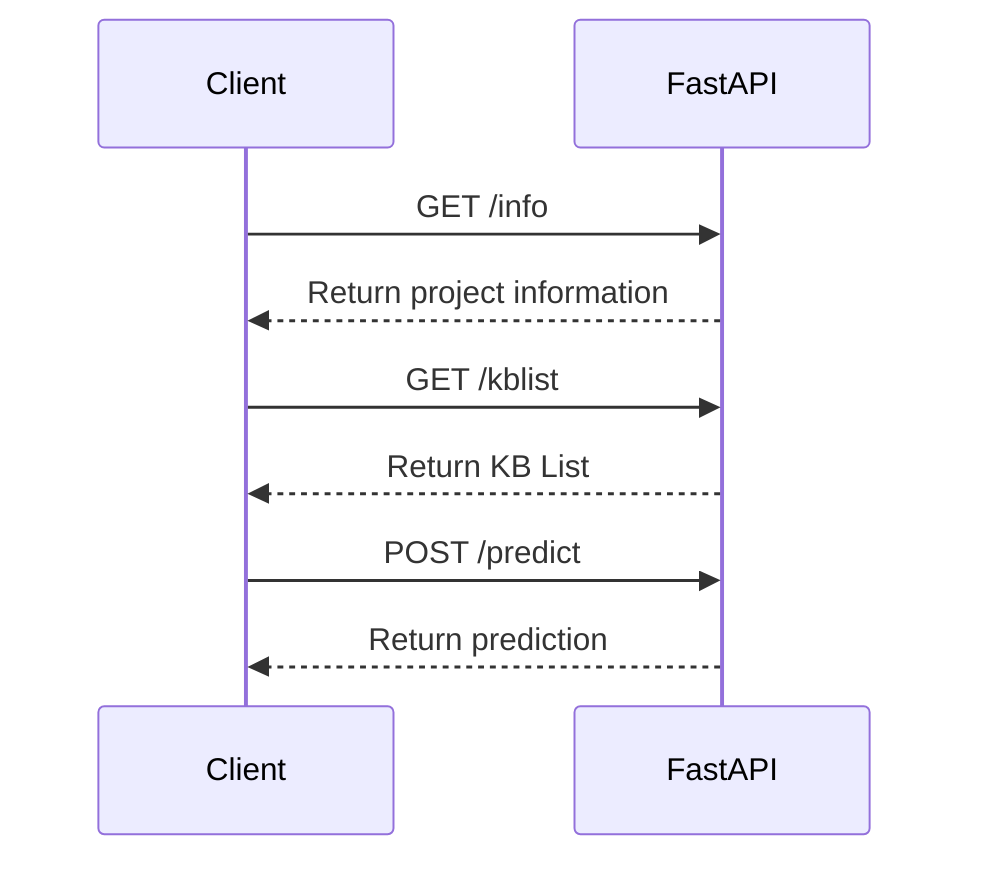

## 🚀 KIA GPT System API 

Проект по созданию нейро-консультанта для ответов на вопросы клиентов, работающего на FastAPI и Docker с поддержкой GPU.

### 📋 Таблица содержания
- [🎯 Особенности](#features)
- [🛠 Требования](#requirements)
- [📦 Установка](#installation)
- [🏃‍♂️ Запуск](#run)
- [📈 API методы](#api-methods)
- [🔒 Лицензия](#license)

<a name="features"></a>
### 🎯 Особенности

- FastAPI для быстрого и эффективного API
- Использование Docker для удобства развертывания
- Поддержка GPU для ускорения вычислений

<a name="requirements"></a>
### 🛠 Требования

- Docker
- Python 3.x
- NVIDIA GPU (опционально)

<a name="installation"></a>
### 📦 Установка

1. Клонировать репозиторий
```bash
git clone <repository_url>
```

2. Перейти в каталог проекта
```bash
cd <project_directory>
```

3. Собрать Docker-образ
```bash
docker-compose build
```

<a name="run"></a>
### 🏃‍♂️ Запуск

Запуск приложения с помощью Docker Compose:

```bash
docker-compose up
```

Приложение будет доступно по адресу: `http://localhost:8000`

<a name="api-methods"></a>
### 📈 API методы

- `GET /`: Главная страница
- `GET /info`: Информация о проекте
- `GET /kblist`: Список доступных баз знаний
- `POST /predict`: Метод для предикта

<a name="license"></a>
### 🔒 Лицензия

MIT License

### 🗺 Схема взаимодействия



---
